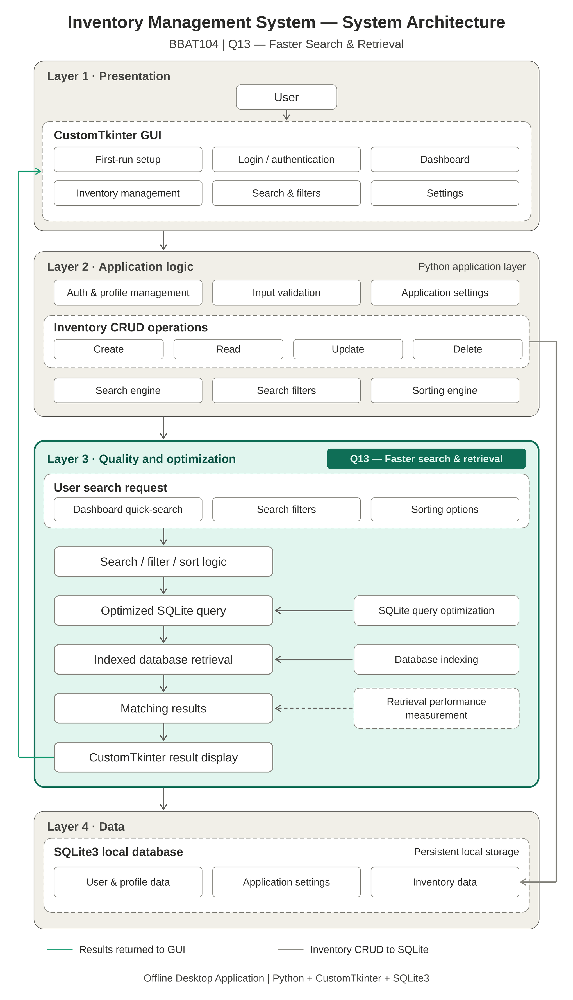
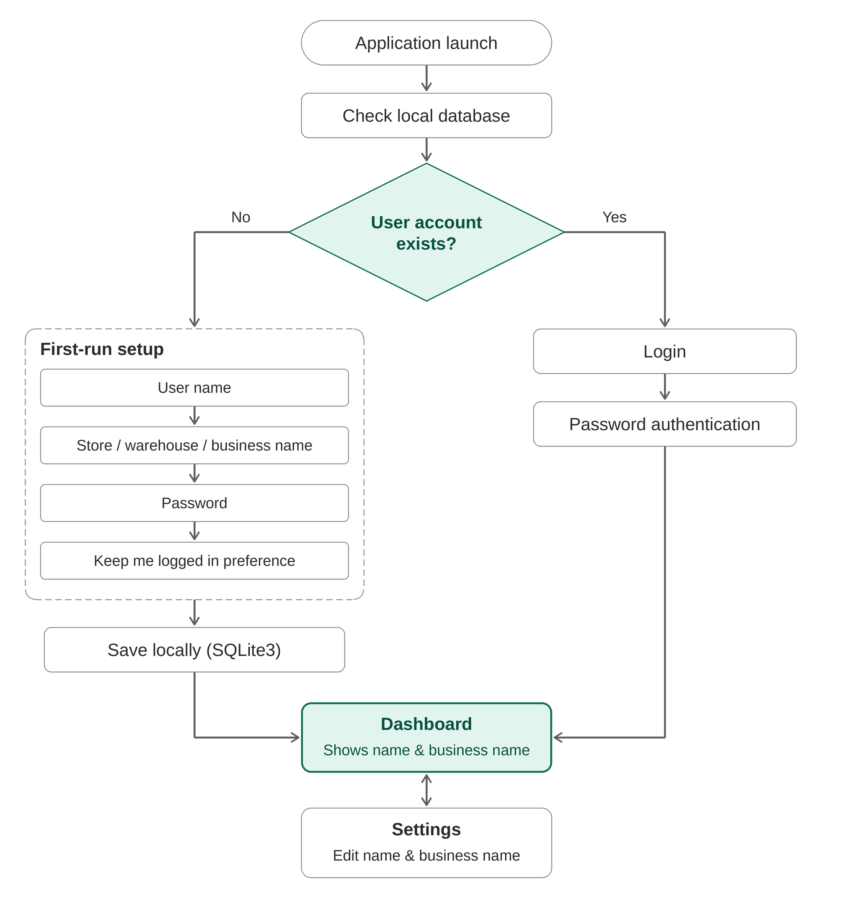

# Inventory Management System

A desktop-based Inventory Management System developed as part of the **BBAT104 – Fundamentals of Total Quality Management (TQM)** project.

## Project Information

| Item | Details |
|---|---|
| **Course** | BBAT104 – Fundamentals of TQM |
| **System** | Inventory Management System |
| **Quality Goal** | Q13 – Faster Search & Retrieval |
| **Platform** | Windows Desktop |
| **Mode** | Fully Offline |
| **Developer** | Lokesh Paneru |

---

## Project Objective

The system provides a simple offline solution for managing inventory records, including adding, updating, deleting, searching, filtering, and sorting products.

The project also applies TQM principles to improve software quality, reliability, usability, and performance.

---

## Key Features

- 🔐 Local user authentication
- 👤 User and organization profile
- 📦 Inventory CRUD operations
- 🔎 Dashboard quick-search
- 🔍 Search filters
- ↕️ Sorting options
- 🗄️ SQLite database
- ⚡ Database query optimization
- ⚙️ Application settings
- 📊 Performance measurement
- 💻 Fully offline desktop application

---

## System Architecture

The application follows a layered architecture consisting of:

1. **Presentation Layer** – CustomTkinter GUI
2. **Application Logic Layer** – Authentication, CRUD, search, filtering, sorting, and validation
3. **Quality & Optimization Layer** – Query optimization, indexing, and retrieval performance measurement
4. **Data Layer** – Local SQLite database

### Architecture Diagram



---

## Authentication Flow

The application supports a first-time setup process for creating the local user account.

On subsequent launches, the user can log in using their password. The **Keep Me Logged In** option can also be controlled through application settings.

### Authentication Flow Diagram



---

## Technology Stack

| Technology | Purpose |
|---|---|
| **Python 3.x** | Core programming language |
| **CustomTkinter** | Desktop GUI |
| **SQLite3** | Local database |
| **Pandas** | Data processing where required |
| **Matplotlib / Seaborn** | TQM/SQC visualizations |
| **Git & GitHub** | Version control and project management |

---

## Database

The application uses **SQLite3** for local and persistent data storage.

The database contains logical groups for:

- User and profile information
- Inventory records
- Application settings

Database operations use parameterized SQL queries to improve reliability and security.

---

## Quality Improvement

The project focuses on **Q13 – Faster Search & Retrieval**.

The implementation includes:

- Search filters
- Sorting options
- Dashboard quick-search
- Database query optimization
- Appropriate database indexing
- Retrieval performance testing

Performance will be evaluated using actual test data rather than fabricated measurements.

---

## Project Structure

```text
TQM Project/
│
├── README.md
├── SRS.md
│
├── images/
│   ├── IMS_Authentication_Flow.png
│   └── IMS_System_Architecture.png
│
└── inv_mng_sys/
    ├── app/
    │   ├── main.py
    │   ├── database/
    │   ├── authentication/
    │   ├── inventory/
    │   ├── dashboard/
    │   ├── settings/
    │   └── ui/
    │
    ├── database/
    ├── tests/
    ├── docs/
    ├── requirements.txt
    ├── .gitignore
    └── run.py
  ```
##  Setup
1. Clone the repository
git clone <repository-url>
cd TQM-Project

2. Create a virtual environment
python -m venv .venv

3. Activate the environment
Windows:
.venv\Scripts\activate

4. Install dependencies
pip install -r inv_mng_sys/requirements.txt

5. Run the application
python inv_mng_sys/run.py

## Project Documentation
- [Software Requirements Specification](SRS.md)
- System Architecture – images/IMS_System_Architecture.png
- Authentication Flow – images/IMS_Authentication_Flow.png
TQM Application
The project applies software quality practices including:
- Requirements definition
- Quality-focused feature development
- Database optimization
- Performance measurement
- FMEA and risk analysis
- Statistical Quality Control
- Continuous improvement
- GitHub-based version control and documentation
### Project Status
Current Stage: Development
The project is being developed incrementally according to the SRS and TQM review requirements.
License
This project is developed for academic purposes as part of the BBAT104 – Fundamentals of Total Quality Management course.
